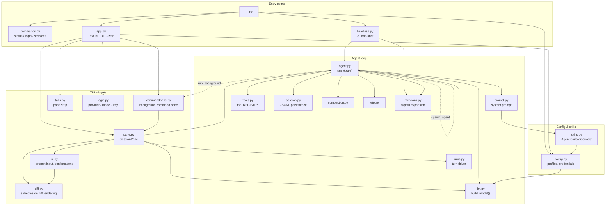

# Paimon


English | [简体中文](README.zh-CN.md)

Paimon is a coding agent that lives in your terminal. It reads and edits files in the current directory and runs commands. It also runs headless and imports as a library, so a stronger agent or a program of your own can drive it.

## Install

```bash
uv tool install paimon   # or: pip install paimon
```

## Getting started

```bash
paimon
```

Or run it without installing anything:

```bash
uvx paimon
```

The first launch asks for a provider, model, API base and key. Then just type what you want done. Write `@path/to/file` in a prompt to hand a file to the agent.

While it runs: `Shift+Tab` switches how much the agent may do on its own (**read** only reads, **auto** edits inside the working directory and has a second model call approve everything else, **yolo** checks nothing and is the default), `Esc` interrupts the current turn, `Ctrl+P` opens the command palette, `Ctrl+C` quits. A line starting with `!` runs in a shell instead of being sent, and Paimon sees what it printed. `!!` keeps it to yourself.

`Ctrl+T` opens another session in a pane of its own, `Ctrl+W` closes one, `Ctrl+PageUp` and `Ctrl+PageDown` move between them, and `Ctrl+G` jumps to a pane waiting for permission. Paimon can work in parallel: ask for two independent things and it starts a second agent in the background, whose answer comes back into the conversation when it is done. It can also leave a command running in a tab of its own, a dev server or a watcher, instead of holding up a turn.

## Web search

Paimon can search the web without an API key. It asks in no permission mode, because a search changes nothing on your machine. Searches go through [ddgs](https://github.com/deedy5/ddgs), a metasearch library, so a query may be sent to any of several public search engines. `--no-web-search` takes the tool away for a run.

## Skills

Paimon loads [Agent Skills](https://agentskills.io) from `~/.config/paimon/skills`, `~/.agents/skills` and every `.agents/skills` from the working directory up to the repository root. Only each skill's name and description go into the system prompt; the model reads the `SKILL.md` when a task matches, and `/skill:name args` sends it explicitly (the `/` command palette lists them). More locations go in `config.json` as `"skills": ["~/.claude/skills"]` or on the command line with `--skill PATH`; `--no-skills` skips the default locations. When two skills share a name, explicit paths beat the project's, which beat the global ones.

## Using Paimon as a subagent

Frontier models are good at planning and reviewing; the steps in between are often mechanical. Point Paimon at a cheaper model and let Claude Code or Codex write the plan and check the result. A profile keeps that model's account separate:

```bash
paimon login --profile glm --model zai:glm-4.7 --api-key-env ZAI_API_KEY
paimon --profile glm -p "apply the plan in PLAN.md" --mode auto --output-format result
```

The bundled skill teaches the calling agent this workflow:

```bash
paimon install-skill                  # into Claude Code (~/.claude/skills/paimon)
paimon install-skill --target codex   # into Codex; --dest DIR for anywhere else
npx skills add aisk/paimon            # the same skill, via skills.sh
```

## Using Paimon as a library

The agent loop is importable, so a Python program can drive it without going through the CLI. `Agent.open()` starts or resumes a session and `agent.run()` yields typed events, one per text chunk, tool call and turn end, which the caller renders or filters however it likes:

```python
import asyncio

from paimon.agent import Agent, TextDelta

async def main():
    agent = Agent.open(mode="auto")
    async for event in agent.run("summarize the tests in this directory"):
        if isinstance(event, TextDelta):
            print(event.text, end="", flush=True)

asyncio.run(main())
```

`Agent.open()` also takes a working directory, an async `confirm` callback for the permission prompts that are left, and a `toolset` to hand the model fewer tools or tools of your own. An agent holds its session until it goes away; to give it back at a definite moment, call `close()` or use the agent as a context manager. It writes the same session files as the CLI, so a run started in code can be resumed later with `paimon -r`.

## Sessions

Every conversation is saved, and long ones are summarized in place near the context limit. Paimon prints the command that brings a session back when you leave:

```bash
paimon -r            # choose a session started in this directory
paimon -r a1b2c3     # resume one by id
paimon -c            # resume the most recent one
paimon sessions      # list them (--json for machines)
paimon log a1b2c3    # what a session did, one line per event
```

## Other ways to run it

```bash
paimon --mode read                  # start in a more cautious permission mode (yolo is the default)
paimon --strict                     # hold every command, even read-only ones
paimon --no-web-search              # take the web search tool away for this run
paimon --web                        # the same UI in a browser (--port, default 8000)
paimon -p "what does cli.py do?"    # one answer on stdout, no UI
cat log.txt | paimon -p "summarize this"
paimon --model zai:glm-4.7          # this model for this run only
paimon --profile work               # a separately configured account
```

`-p` never stops to ask, so with the default `yolo` mode it can already write files and run commands. Add `--output-format result` for a single JSON object with the outcome, which is what a calling program should read. `paimon --help` lists the rest.

Inside a [Herdr](https://herdr.dev) pane the UI reports its state and resume command to Herdr on its own, with nothing to install.

## Configuration

Each profile keeps its model settings in `~/.config/paimon/<name>/config.json`, written by the first launch or by `paimon login`. A ChatGPT plan works in place of an API key: `paimon login --model chatgpt:gpt-5.5` signs in through the browser. Sessions live in `~/.local/share/paimon/sessions/`.

Read and auto modes run a small set of clearly read-only commands (`ls`, `cat`, `git status`, …) on their own; `--strict` turns that off, and on Windows, where cmd.exe runs the commands, none are recognized. Read mode refuses everything else. Auto mode asks a reviewer model, which sees your messages and the agent's tool calls but not its reasoning or any tool output, and answers allow or block. It asks you instead when the reviewer cannot be reached or has blocked three calls in a row, and under `-p` those are refusals. Set `"review_model": "provider:name"` in the config to review with a different model than the one doing the work. **All of this is a guardrail against agent mistakes, not a security boundary.** For real isolation, run Paimon inside a container or VM.

## Architecture

`Agent.run` is a UI-agnostic stream of events; the TUI, `--web` and headless mode are three renderers over that one stream. An agent holds the subagents and background commands it starts. A subagent is another `Agent` running as a task in the same process, and its answer is delivered to its parent as a message.



## Telemetry

Each launch sends one anonymous event to Google Analytics: a random install id, the launch mode, the version, the OS name, the language from `LC_ALL`/`LANG`, whether this is the first launch, and the configured provider and model name. Nothing from your sessions, prompts, files or credentials is included. Set `PAIMON_NO_TELEMETRY=1` or `DO_NOT_TRACK=1` to turn it off.
