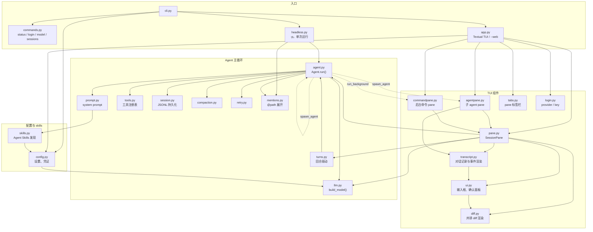

# Paimon


[English](README.md) | 简体中文

Paimon 是一个终端里的 coding agent。它读写当前目录下的文件，执行命令。它也支持无头运行，还可以作为库导入，由更强的 agent 或者你自己的程序来驱动。

## 安装

```bash
uv tool install paimon   # 或者：pip install paimon
```

## 快速开始

```bash
paimon
```

或者不安装直接运行：

```bash
uvx paimon
```

首次启动会询问 provider 及其 API base 和 key，然后选择模型。之后输入要完成的任务即可。在提示中写 `@path/to/file` 可以把文件提供给 agent。

运行时：`Shift+Tab` 切换 agent 的自主程度（**read** 只读，**auto** 放行工作目录内的编辑，其余操作交给另一次模型调用审批，**yolo** 不做任何检查，也是默认值），`Esc` 打断当前回合，`Ctrl+P` 打开命令面板，`Ctrl+C` 退出。以 `!` 开头的一行不发给模型，而是直接在 shell 里执行，输出 Paimon 也能看到。`!!` 则不告诉它。

`Ctrl+T` 在新 pane 里打开另一个会话，`Ctrl+W` 关闭当前 pane，`Ctrl+PageUp` 和 `Ctrl+PageDown` 在 pane 之间切换，`Ctrl+G` 跳到正在等待授权的 pane，`Ctrl+L` 将键盘焦点返回当前 pane 的输入框或待回答面板。状态栏会显示键盘当前在输入、阅读还是回答区域；切换 pane 会保留阅读焦点，后台任务完成不会抢走键盘。Paimon 也能并行干活：让它同时做两件互不相干的事，它会在单独的 tab 里起第二个 agent，你可以在那里看它干活、回答它的授权请求，做完后结果会回到当前会话里，关掉 tab 就是停掉它。它也能把一条命令留在 tab 里跑，比如开发服务器或者文件监视，不占着当前回合。

## 网页搜索

Paimon 可以搜索网页，不需要 API key。任何权限模式下都不会询问，因为搜索不会改动本机的任何东西。搜索通过元搜索库 [ddgs](https://github.com/deedy5/ddgs) 进行，所以一条 query 可能被发往多个公共搜索引擎中的任意一个。`--no-web-search` 可以在本次运行中去掉这个工具。

## Skills

Paimon 会从 `~/.config/paimon/skills`、`~/.agents/skills` 以及工作目录到仓库根之间每一层的 `.agents/skills` 加载 [Agent Skills](https://agentskills.io)。system prompt 里只放每个 skill 的名字和描述，任务匹配时模型自己去读 `SKILL.md`，也可以用 `/skill:name 参数` 显式发送（`/` 命令面板里列出了它们）。其他位置可以写进 `config.json` 的 `"skills": ["~/.claude/skills"]`，或者用命令行参数 `--skill PATH`；`--no-skills` 跳过默认位置。同名时显式指定的优先于项目的，项目的优先于全局的。

## 当作 subagent 使用

前沿模型擅长制定计划和验收结果，中间的执行步骤往往比较机械。让 Paimon 使用成本较低的模型执行，由 Claude Code 或 Codex 制定计划并检查结果。先登录该模型的 provider，之后每次运行时指定模型：

```bash
paimon login zai --api-key-env ZAI_API_KEY
paimon --model zai:glm-4.7 -p "apply the plan in PLAN.md" --mode auto --output-format result
```

自带的 skill 会向调用方 agent 说明这套流程：

```bash
paimon install-skill                  # 安装到 Claude Code（~/.claude/skills/paimon）
paimon install-skill --target codex   # 安装到 Codex；--dest DIR 安装到任意目录
npx skills add aisk/paimon            # 通过 skills.sh 安装同一个 skill
```

## 当作库使用

agent 循环本身是可以导入的，Python 程序不必经过 CLI 就能驱动它。`Agent.open()` 新建或恢复一个会话，`agent.run()` 产出类型化的事件，每段文本、每次工具调用、每个回合结束各一个，调用方自己决定怎么渲染或过滤：

```python
import asyncio

from paimon.agent import Agent, TextDelta

async def main():
    agent = Agent.open(mode="auto")
    async for event in agent.run("summarize the tests in this directory"):
        if isinstance(event, TextDelta):
            print(event.text, end="", flush=True)

asyncio.run(main())
```

`Agent.open()` 还接受工作目录、用于剩余权限确认的异步 `confirm` 回调，以及 `toolset`，可以只给模型一部分工具，或者换成你自己的工具。agent 被回收时会交还会话，想在确定的时刻交还就调 `close()`，或者把它当上下文管理器用。它写的会话文件和 CLI 一样，所以代码里跑出来的会话之后可以用 `paimon -r` 恢复。

## 会话

每次对话都会保存，很长的对话在接近上下文上限时会被原地总结。退出时 Paimon 会打印恢复该会话的命令：

```bash
paimon -r            # 从当前目录的会话中选择
paimon -r a1b2c3     # 按 id 恢复
paimon -c            # 恢复最近一个会话
paimon sessions      # 列出会话（--json 输出机器可读格式）
paimon log a1b2c3    # 查看会话做了什么，每个事件一行
```

## 其他运行方式

```bash
paimon --mode read                  # 以更谨慎的权限模式启动（默认为 yolo）
paimon --strict                     # 不再放行只读命令
paimon --no-web-search              # 本次运行不提供网页搜索工具
paimon --web                        # 在浏览器中使用同一套 UI（--port，默认 8000）
paimon -p "what does cli.py do?"    # 直接在 stdout 输出回答，不启动 UI
cat log.txt | paimon -p "summarize this"
paimon --model zai:glm-4.7          # 仅本次运行使用该模型
```

`-p` 不会停下来询问，配合默认的 `yolo` 模式，它已经可以修改文件和执行命令。加 `--output-format result` 会输出一个包含结果的 JSON 对象，调用方程序读这个就够了。其余选项见 `paimon --help`。

### 调试 Textual UI

需要让 Paimon 排查自己的布局或样式时，用 `paimon --textual-debug` 启动（也可与 `--web` 一起使用）。默认不启用；开启后模型会多出五个只作用于当前 UI 进程的工具：

- `textual_inspect`：按 CSS selector 查看 DOM、geometry、pseudo-classes、焦点和 computed CSS；
- `textual_eval` / `textual_exec`：在 UI 进程里运行 Python，支持 private API、持久变量和 top-level `await`；
- `textual_apply_css`：动态叠加 CSS 并立即重新布局；
- `textual_screenshot`：把当前渲染结果导出成 SVG。

例如可以直接让它“检查 `#prompt` 为什么比预期窄，动态试一个修复并截图”。`textual_exec` 有意提供完整的进程内 Python 能力，能修改任意 Textual/Paimon 状态；这个选项只适合开发调试，不应对不受信任的 prompt 开启。动态修改只保留到进程退出，确定修复后仍需让 Paimon编辑源码。

## 配置

模型设置保存在 `~/.config/paimon/config.json`，由首次启动或 `paimon login` 写入。每个 provider 各自保存凭据，用 `paimon model provider:name` 或命令面板里的 Switch model 选择要用的模型。也可以用 ChatGPT 订阅代替 API key，`paimon login chatgpt` 会通过浏览器登录。会话存放在 `~/.local/share/paimon/sessions/`。

read 和 auto 模式会直接执行一小组明确只读的命令（`ls`、`cat`、`git status` 等），`--strict` 可以关掉，Windows 上命令由 cmd.exe 执行，一条也不识别。read 模式拒绝其余所有操作。auto 模式把它们交给审批模型，它能看到你的消息和 agent 的工具调用，看不到 agent 的推理和工具输出，只回答放行或拦截。审批模型不可用或者连续拦截三次时改为询问你，`-p` 下则直接拒绝。当前的模型默认用同一家里快速档的那个来审批（GPT 用 Luna，Claude 用 Haiku，GLM 用 Flash），其余模型自己审自己，在配置里写 `"review_model": "provider:name"` 可以自行指定。**这些都是防止 agent 失误的护栏，不是安全边界。** 需要真正的隔离时，请在容器或虚拟机中运行 Paimon。

## 架构

`Agent.run` 产出一串与 UI 无关的事件流，TUI、`--web` 和无头模式都是这条事件流的渲染器。agent 自己持有它启动的子 agent 和后台命令。子 agent 是同一进程里作为任务运行的另一个 `Agent`，它的结果会作为一条消息送回父 agent。想把 job 显示出来的 UI 挂上 `Agent.open_job` 即可，TUI 就是这样给每个 job 开 pane 的。



## 遥测

每次启动会向 Google Analytics 发送一条匿名事件：随机生成的安装 id、启动方式、版本号、操作系统名称、取自 `LC_ALL`/`LANG` 的语言、是否首次启动，以及配置的 provider 和模型名。会话、提示词、文件和密钥一概不上报。设置 `PAIMON_NO_TELEMETRY=1` 或 `DO_NOT_TRACK=1` 可以关闭。
